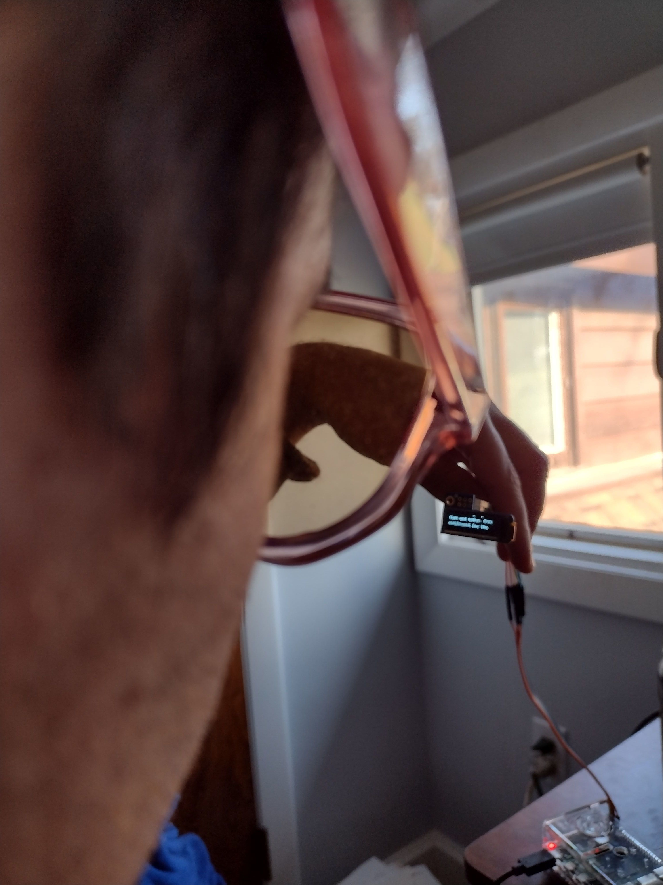

# guygrr counter

a raspberry pi application to detect when ur guys are saying grr too much

to use, simply say GRRR loudly next to the device and the on-board microphone and voice detection system (vosk) will print to the display if a grr was detected, and keep a running count

also has a bunch of other dumb add ons because it is irresistable such as printing star trek facts

## Pictures

the application is a smart glass application that attaches to cool sunglasses
